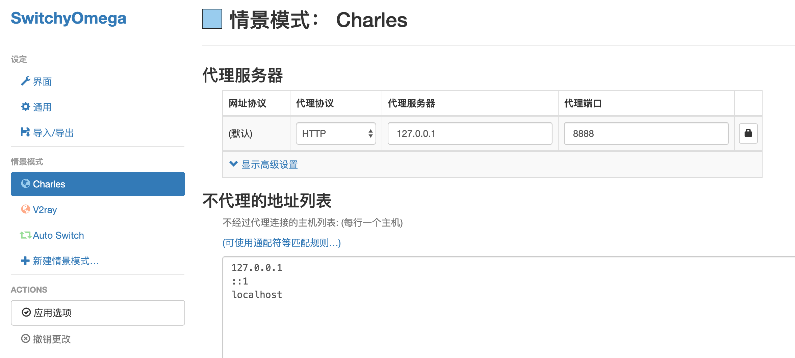
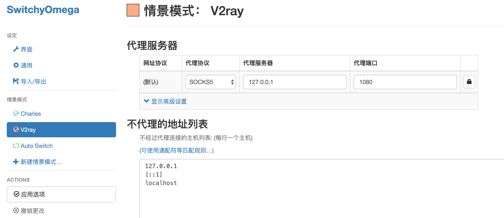
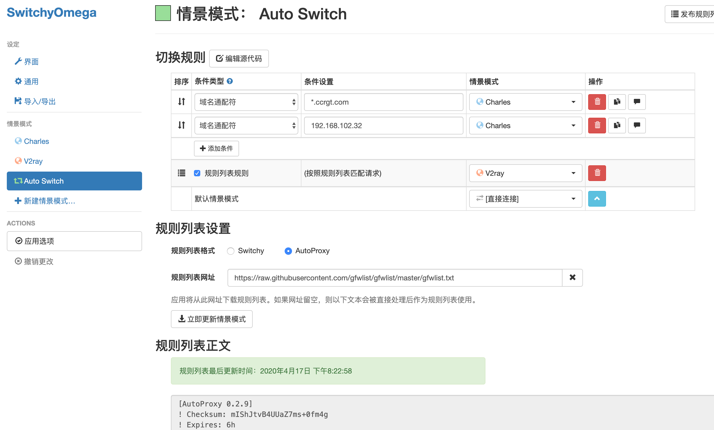

各端 VPN 软件推荐

- ios：[Shadowrocket（小飞机：可通过微信公众号共享岛获取）](https://apps.apple.com/us/app/shadowrocket/id932747118)
- macOS：[V2rayU](https://github.com/yanue/V2rayU/releases)
- Android：[V2rayNG](https://github.com/2dust/v2rayNG/releases)
- Windows：[Netch](https://github.com/NetchX/Netch/releases)
- OpenVPN用于Windows连接公司VPN，读取ovpn文件
- [TunnelBlick用于macOS连接公司VPN，读取ovpn文件](https://tunnelblick.net/downloads.html)
- [V2Ray 一键安装脚本](https://github.com/233boy/v2ray/wiki)

[Proxy SwitchyOmega 配置](https://proxy-switchyomega.com/settings/)

规则列表网址：https://raw.githubusercontent.com/gfwlist/gfwlist/master/gfwlist.txt

